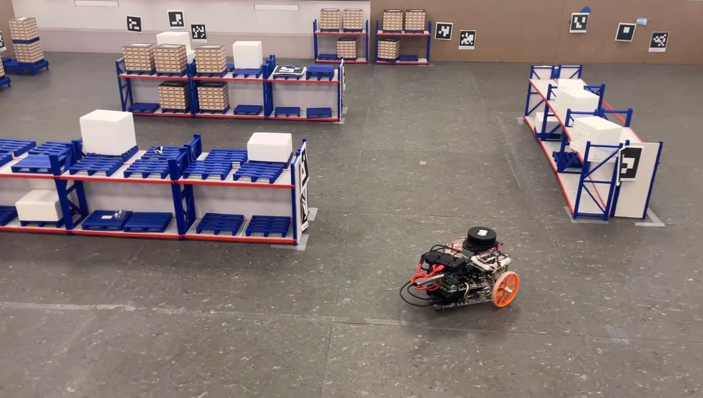

# MCL + A* Autonomous Navigation — PuzzleBot



> Monte Carlo Localization with EKF backup and A* path planning for a differential drive robot on ROS 2.

---

## Overview

Autonomous navigation system for the **PuzzleBot** (differential drive robot) combining:

- **SLAM** — particle-filter based mapping with log-odds occupancy grid and Bresenham ray tracing. Press `s` to save the map.
- **MCL (Monte Carlo Localization)** — adaptive particle filter (KLD-sampling) for pose estimation on a pre-built map.
- **EKF backup** — maintains position estimation when LiDAR confidence drops (unmapped obstacles, feature-sparse zones).
- **MCL ↔ EKF state machine** — smooth transitions and weighted fusion in synchronization mode.
- **Adaptive modules** — RAM (Robust Adaptive Motion Model) for motion noise and a Bandit (UCB) sensor model configuration selector.
- **A* planner** — path planning on an inflated occupancy map with reactive LiDAR-based obstacle avoidance.
- **Autonomous exploration** — frontier-based exploration with periodic replanning and obstacle inflation.
- **Standalone obstacle avoidance** — Bug0, Bug1, Bug2 wall-following algorithms.

---

## Repository Structure

```
puzzlebot_ws/
├── src/
│   ├── mcl_robot_pb/          # Main navigation package
│   │   ├── mcl_robot_pb/
│   │   │   ├── mcl_node.py        # MCL + EKF localization
│   │   │   ├── astar_node.py      # A* planner + motion controller
│   │   │   ├── slam_node.py       # SLAM (map building)
│   │   │   ├── exploration_node.py# Frontier-based exploration
│   │   │   └── odom_node.py       # Wheel encoder odometry (real robot)
│   │   └── maps/
│   │       ├── slam_map.npy       # Occupancy map (output from SLAM)
│   │       └── slam_log_odds.npy  # Raw log-odds map
│   ├── obstacle_avoidance/    # Standalone Bug0/Bug1/Bug2 algorithms
│   └── puzzle_sim/            # Gazebo simulation (URDF + launch)
└── assets/
```

---

## System Architecture

```
/odom  ──────────────────────────────────────────────────────┐
                                                              ▼
                                                    ┌─────────────────┐
                                                    │  odom_callback  │
                                                    │  RAM motion     │
                                                    │  EKF predict    │
                                                    └────────┬────────┘
                                                             │ propagated particles
/scan  ──────────────────────────────────────────────────────┤
                                                             ▼
                                                   ┌──────────────────┐
                                                   │  scan_callback   │
                                                   │  Ray casting     │
                                                   │  Beam model      │
                                                   │  Bandit selector │
                                                   │  FSM MCL↔EKF     │
                                                   └────────┬─────────┘
                                                            │
                                               /mcl_pose ───┘
                                                            │
/goal_pose ──────────────────────────────────────────────── ▼
                                                  ┌──────────────────┐
                                                  │   astar_node     │
                                                  │   A* + inflation │
                                                  │   P controller   │
                                                  │   LiDAR avoidance│
                                                  └────────┬─────────┘
                                                           │
                                               /cmd_vel ───┘
```

---

## Nodes

### `mcl_node.py` — Localization

Robot pose estimation via particle filter with EKF backup.

| Subscribes | Type | Description |
|---|---|---|
| `/odom` | `nav_msgs/Odometry` | Odometry for particle propagation and EKF prediction |
| `/scan` | `sensor_msgs/LaserScan` | LiDAR measurements for weight update |

| Publishes | Type | Description |
|---|---|---|
| `/mcl_pose` | `geometry_msgs/PoseStamped` | Estimated pose (MCL, EKF, or fused) |
| `/map` | `nav_msgs/OccupancyGrid` | Map loaded from `.npy` |

**State machine:**

| State | Entry condition | Pose source |
|---|---|---|
| `MCL` | Convergence > `CONV_HIGH` | Particle median |
| `EKF` | Convergence < `CONV_LOW` for ≥ N scans | EKF prediction (odometry only) |
| `SYNC` | MCL recovering | Weighted fusion MCL + EKF |

---

### `astar_node.py` — Path Planning & Control

| Subscribes | Type | Description |
|---|---|---|
| `/mcl_pose` | `geometry_msgs/PoseStamped` | Current robot pose |
| `/goal_pose` | `geometry_msgs/PoseStamped` | Goal published from RViz |
| `/scan` | `sensor_msgs/LaserScan` | Reactive obstacle avoidance |

| Publishes | Type | Description |
|---|---|---|
| `/cmd_vel` | `geometry_msgs/Twist` | Velocity commands |
| `/planned_path` | `nav_msgs/Path` | Full path for RViz |
| `/current_waypoint` | `geometry_msgs/PoseStamped` | Active waypoint |

---

### `slam_node.py` — Map Building

Particle-filter SLAM using log-odds occupancy grid updated with Bresenham ray tracing.

| Subscribes | Type | Description |
|---|---|---|
| `/odom` | `nav_msgs/Odometry` | Motion model for particle propagation |
| `/scan` | `sensor_msgs/LaserScan` | Sensor model for particle weighting + map update |

| Publishes | Type | Description |
|---|---|---|
| `/map` | `nav_msgs/OccupancyGrid` | Live occupancy grid |
| `/slam_pose` | `geometry_msgs/PoseStamped` | Estimated pose during mapping |

Press **`s`** to save the map to `/tmp/slam_map.npy` and `/tmp/slam_log_odds.npy`.

---

### `exploration_node.py` — Autonomous Exploration

Frontier-based exploration: detects free/unknown boundaries on the live map, selects the nearest cluster, plans an A* path toward it, and replans every `REPLAN_INTERVAL` seconds.

| Subscribes | Type | Description |
|---|---|---|
| `/map` | `nav_msgs/OccupancyGrid` | Live map from SLAM |
| `/slam_pose` | `geometry_msgs/PoseStamped` | Current robot pose |
| `/scan` | `sensor_msgs/LaserScan` | Reactive obstacle avoidance |

| Publishes | Type | Description |
|---|---|---|
| `/cmd_vel` | `geometry_msgs/Twist` | Velocity commands |

---

### `odom_node.py` — Wheel Encoder Odometry (real robot)

Integrates encoder velocities from the PuzzleBot's microcontroller into a standard `nav_msgs/Odometry` message and broadcasts the `odom → base_link` TF transform.

| Subscribes | Type | Description |
|---|---|---|
| `/VelocityEncL` | `std_msgs/Float32` | Left wheel angular velocity (rad/s) |
| `/VelocityEncR` | `std_msgs/Float32` | Right wheel angular velocity (rad/s) |

| Publishes | Type | Description |
|---|---|---|
| `/odom` | `nav_msgs/Odometry` | Integrated odometry |

Robot parameters: `WHEEL_RADIUS = 0.05 m`, `WHEEL_BASE = 0.19 m`.

---

## Key Parameters

### Map

| Parameter | Value | Description |
|---|---|---|
| `MAP_X_MIN/MAX` | -4.0 / 5.0 m | Map extent in X |
| `MAP_Y_MIN/MAX` | -3.0 / 6.0 m | Map extent in Y |
| `RESOLUTION` | 0.05 m/px | Map resolution |

### MCL

| Parameter | Value | Description |
|---|---|---|
| `N` | 200 | Maximum number of particles |
| `N_MIN` | 30 | Minimum with KLD-sampling |
| `P_NOISE` | 0.8 | Gaussian model weight in beam model |
| `CONV_LOW` | 0.25 | Low convergence threshold → failover to EKF |
| `CONV_HIGH` | 0.55 | High convergence threshold → MCL regains control |
| `SCANS_TO_FAILOVER` | 5 | Consecutive low-confidence scans before EKF takeover |

### A*

| Parameter | Value | Description |
|---|---|---|
| `INFLATE_RADIUS` | 6 px (0.3 m) | Obstacle inflation radius |
| `WAYPOINT_TOL` | 0.25 m | Tolerance to advance to next waypoint |
| `GOAL_TOL` | 0.35 m | Tolerance to declare goal reached |
| `LIN_VEL` | 0.07 m/s | Nominal linear velocity |
| `ANG_VEL` | 0.07 rad/s | Maximum angular velocity |

---

## Requirements

- ROS 2 Humble / Jazzy
- Python >= 3.10
- `numpy`, `opencv-python`, `scipy`, `pynput`
- RPLIDAR A1 (or Gazebo simulation)
- Gazebo Classic (for simulation)

---

## Workflow

### Phase 1 — Build a map with SLAM

Run the robot manually (teleop) while SLAM builds the map. Press `s` to save.

```bash
# Terminal 1 — Simulation or real robot (see below)

# Terminal 2 — SLAM
ros2 run mcl_robot_pb slam_node

# Terminal 3 — Teleop
ros2 run teleop_twist_keyboard teleop_twist_keyboard

# When mapping is complete, focus the slam_node terminal and press 's'
# Map saved to: /tmp/slam_map.npy  and  /tmp/slam_log_odds.npy
```

Copy the saved map to the package:

```bash
cp /tmp/slam_map.npy     src/mcl_robot_pb/maps/slam_map.npy
cp /tmp/slam_log_odds.npy src/mcl_robot_pb/maps/slam_log_odds.npy
```

> **Note:** `mcl_node` and `astar_node` currently load the map from a hardcoded path.
> Update the `np.load(...)` calls in both files to point to your map location before running.

---

### Phase 2 — Autonomous navigation

#### Simulation (Gazebo)

```bash
# Terminal 1 — PuzzleBot simulation
ros2 launch puzzle_sim_pb gazebo.launch.py

# Terminal 2 — MCL + EKF localization
ros2 run mcl_robot_pb mcl_node

# Terminal 3 — A* planner + control
ros2 run mcl_robot_pb astar_node
```

#### Real robot

```bash
# On the PuzzleBot (SSH in)
ssh puzzlebot@<ROBOT_IP>
export ROS_DOMAIN_ID=0

# Terminal 1 — micro-ROS agent
ros2 launch puzzlebot_ros micro_ros_agent.launch.py

# Terminal 2 — RPLIDAR
ros2 run rplidar_ros rplidar_composition

# On the host machine:

# Terminal 3 — Odometry
ros2 run mcl_robot_pb odom_node

# Terminal 4 — MCL + EKF localization
ros2 run mcl_robot_pb mcl_node

# Terminal 5 — A* planner + control
ros2 run mcl_robot_pb astar_node
```

#### Optional — Autonomous exploration (instead of A*)

```bash
ros2 run mcl_robot_pb exploration_node
```

---

### Phase 3 — Visualize in RViz

Add these topics:

| Topic | Message type |
|---|---|
| `/map` | `nav_msgs/OccupancyGrid` |
| `/mcl_pose` | `geometry_msgs/PoseStamped` |
| `/planned_path` | `nav_msgs/Path` |
| `/current_waypoint` | `geometry_msgs/PoseStamped` |

Use **2D Goal Pose** in RViz to send a navigation goal.

---

## Build

```bash
cd puzzlebot_ws
colcon build --symlink-install
source install/setup.bash
```

---

## Internal Modules

### EKFBackup

3-state EKF `[x, y, θ]` with a non-linear differential drive kinematic model. Analytical Jacobian. Process noise proportional to motion (`Q_trans`, `Q_rot`). Adaptive observation noise scaled by MCL convergence.

### RobustAdaptiveMotionModel (RAM)

Adapts the motion noise covariance online using a Robbins-Monro scheme. Target acceptance rate: 35%.

### BanditSensorSelector

Selects the optimal beam model configuration (σ_hit, ray skip) using variance-adjusted UCB. Automatically balances speed and precision of the sensor model.

---

## Notes

- In environments with dynamic obstacles or feature-sparse zones, the EKF preserves the relative trajectory while MCL recovers.
- Particles are redistributed around the EKF estimate during the `EKF` state, speeding up reconvergence.
- Vectorized ray casting operates in pixel space for maximum NumPy performance.
- The `slam_node` uses `pynput` for the keyboard save shortcut — no root required.

---

## Author

**Felipe Garcia** — Robotics & Digital Systems Engineering, Tecnológico de Monterrey

📫 [garciafjg@outlook.com](mailto:garciafjg@outlook.com) | [a01705893@tec.mx](mailto:a01705893@tec.mx)
